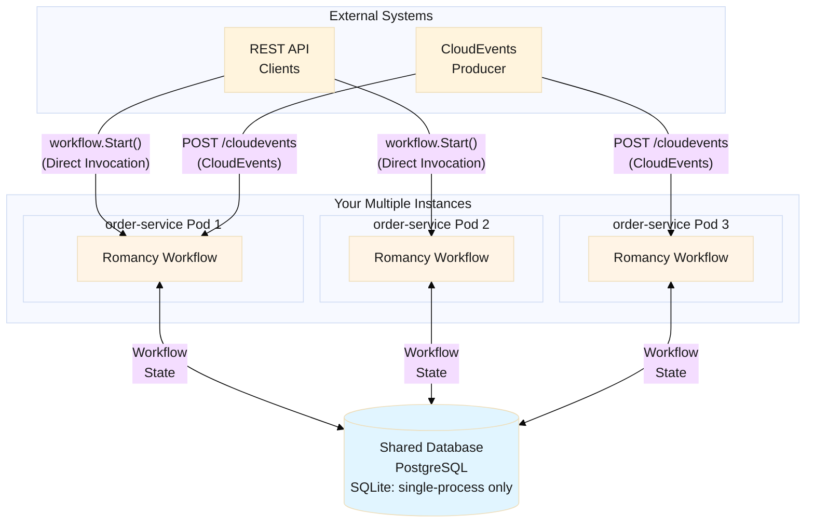

**Romancy** (from "Romance" - medieval chivalric tales) - Durable execution framework for Go

> Lightweight durable execution framework - no separate server required

[](https://opensource.org/licenses/MIT)
[](https://go.dev/dl/)

---

## Overview

Romancy is a lightweight durable execution framework for Go that runs as a **library** in your application - no separate workflow server required. It provides automatic crash recovery through deterministic replay, allowing **long-running workflows** to survive process restarts and failures without losing progress.

**Perfect for**: Order processing, distributed transactions (Saga pattern), AI agent orchestration, and any workflow that must survive crashes.

## Key Features

- ✨ **Lightweight Library**: Runs in your application process - no separate server infrastructure
- 🔄 **Durable Execution**: Deterministic replay with workflow history for automatic crash recovery
- 🎯 **Workflow & Activity**: Clear separation between orchestration logic and business logic
- 🔁 **Saga Pattern**: Automatic compensation on failure with `WithCompensation` option
- 🌐 **Multi-worker Execution**: Run workflows safely across multiple servers or containers
- 🔒 **Go Generics**: Type-safe workflows with compile-time validation
- 📦 **Transactional Outbox**: Reliable event publishing with guaranteed delivery
- ☁️ **CloudEvents Support**: Native support for CloudEvents protocol
- ⏱️ **Event & Timer Waiting**: Free up worker resources while waiting for events or timers, resume on any available worker
- 📨 **Channel-Based Messaging**: Publish/Subscribe with broadcast and competing consumer modes
- 🔄 **Recur Pattern**: Erlang-style tail recursion for unbounded workflows without history growth
- 📡 **PostgreSQL LISTEN/NOTIFY**: Real-time event delivery with near-zero latency
- 🤖 **MCP Integration**: Expose workflows as MCP tools for AI assistants

## Use Cases

Romancy excels at orchestrating **long-running workflows** that must survive failures:

- **🏢 Long-Running Jobs**: Order processing, data pipelines, batch jobs - from minutes to days, weeks, or even months
- **🔄 Distributed Transactions**: Coordinate microservices with automatic compensation (Saga pattern)
- **🤖 AI Agent Workflows**: Orchestrate multi-step AI tasks (LLM calls, tool usage, long-running inference)
- **📡 Event-Driven Workflows**: React to external events with guaranteed delivery and automatic retry

### Business Process Automation

Romancy's waiting functions make it ideal for time-based and event-driven business processes:

- **📧 User Onboarding**: Send reminders if users haven't completed setup after N days
- **🎁 Campaign Processing**: Evaluate conditions and notify winners after campaign ends
- **💳 Payment Reminders**: Send escalating reminders before payment deadlines
- **📦 Scheduled Notifications**: Shipping updates, subscription renewals, appointment reminders

**Waiting functions**:

- `Sleep(duration)`: Sleep for a relative duration
- `SleepUntil(untilTime)`: Sleep until an absolute datetime (e.g., campaign end date)
- `WaitEvent(eventType)`: Wait for external events (near real-time response)

```go
type ReminderResult struct {
    Status string `json:"status"`
}

var onboardingReminder = romancy.DefineWorkflow("onboarding_reminder",
    func(ctx *romancy.WorkflowContext, userID string) (ReminderResult, error) {
        // Sleep for 3 days
        if err := romancy.Sleep(ctx, 3*24*time.Hour); err != nil {
            return ReminderResult{}, err
        }
        completed, err := checkCompleted.Execute(ctx, userID)
        if err != nil {
            return ReminderResult{}, err
        }
        if !completed.Completed {
            return sendReminder.Execute(ctx, userID)
        }
        return ReminderResult{Status: "completed"}, nil
    },
)
```

**Key benefit**: Workflows **never lose progress** - crashes and restarts are handled automatically through deterministic replay.

## Architecture

Romancy runs as a lightweight library in your applications, with all workflow state stored in a shared database:



**Key Points**:

- Multiple workers can run simultaneously across different pods/servers
- Each workflow instance runs on only one worker at a time (automatic coordination)
- `WaitEvent()` and `Sleep()` free up worker resources while waiting, resume on any worker when event arrives or timer expires
- Automatic crash recovery with stale lock cleanup and workflow auto-resume

## Quick Start

```go
package main

import (
    "context"
    "log"
    "net/http"

    "github.com/i2y/romancy"
)

// Result types
type PaymentResult struct {
    Status string  `json:"status"`
    Amount float64 `json:"amount"`
}

type OrderResult struct {
    OrderID string        `json:"order_id"`
    Payment PaymentResult `json:"payment"`
}

// Define an activity
var processPayment = romancy.DefineActivity("process_payment",
    func(ctx context.Context, amount float64) (PaymentResult, error) {
        log.Printf("Processing payment: $%.2f", amount)
        return PaymentResult{Status: "paid", Amount: amount}, nil
    },
)

// Define a workflow
var orderWorkflow = romancy.DefineWorkflow("order_workflow",
    func(ctx *romancy.WorkflowContext, orderID string, amount float64) (OrderResult, error) {
        result, err := processPayment.Execute(ctx, amount)
        if err != nil {
            return OrderResult{}, err
        }
        return OrderResult{OrderID: orderID, Payment: result}, nil
    },
)

func main() {
    // Create app with SQLite storage
    app := romancy.NewApp(
        romancy.WithDatabase("workflow.db"),
        romancy.WithWorkerID("worker-1"),
    )

    ctx := context.Background()
    if err := app.Start(ctx); err != nil {
        log.Fatal(err)
    }
    defer app.Shutdown(ctx)

    // Start workflow
    instanceID, err := orderWorkflow.Start(ctx, app, "ORD-123", 99.99)
    if err != nil {
        log.Fatal(err)
    }
    log.Printf("Started workflow: %s", instanceID)

    // Serve CloudEvents endpoint
    http.Handle("/", app.Handler())
    log.Fatal(http.ListenAndServe(":8001", nil))
}
```

**What happens on crash?**

1. Activities already executed return cached results from history
2. Workflow resumes from the last checkpoint
3. No manual intervention required

## Installation

```bash
go get github.com/i2y/romancy
```

**Database Support**:

| Database | Use Case | Multi-Pod Support | Production Ready |
|----------|----------|-------------------|------------------|
| **SQLite** | Development, testing, single-process | ⚠️ Limited | ⚠️ Limited |
| **PostgreSQL** | Production, multi-process/multi-pod | ✅ Yes | ✅ Recommended |
| **MySQL** | Production, multi-process/multi-pod (8.0+) | ✅ Yes | ✅ Yes |

**Important**: For distributed execution (multiple worker pods/containers), you **must** use PostgreSQL or MySQL. SQLite's single-writer limitation makes it unsuitable for multi-pod deployments.

## Next Steps

- **[Getting Started](getting-started/installation)**: Installation and setup guide
- **[Core Concepts](getting-started/concepts)**: Learn about workflows, activities, and durable execution
- **[Examples](examples/simple)**: See Romancy in action with real-world examples
- **[HTTP Integration](examples/http-integration)**: Integrate with any Go HTTP router
- **[Channels](core-features/channels)**: Pub/Sub and work queue patterns with channel-based messaging
- **[Recur Pattern](core-features/recur)**: Handle unbounded workflows with Erlang-style tail recursion
- **[Transactional Outbox](core-features/transactional-outbox)**: Reliable event publishing with guaranteed delivery
- **[Lifecycle Hooks](core-features/hooks)**: Add observability and monitoring with custom hooks
- **[CloudEvents HTTP Binding](core-features/events/cloudevents-http-binding)**: CloudEvents specification compliance and error handling
- **[MCP Integration](integrations/mcp)**: Expose workflows as MCP tools for AI assistants

## License

This project is licensed under the MIT License - see the [LICENSE](https://github.com/i2y/romancy/blob/main/LICENSE) file for details.

## Support

- **GitHub Issues**: [https://github.com/i2y/romancy/issues](https://github.com/i2y/romancy/issues)
- **GitHub Repository**: [https://github.com/i2y/romancy](https://github.com/i2y/romancy)
